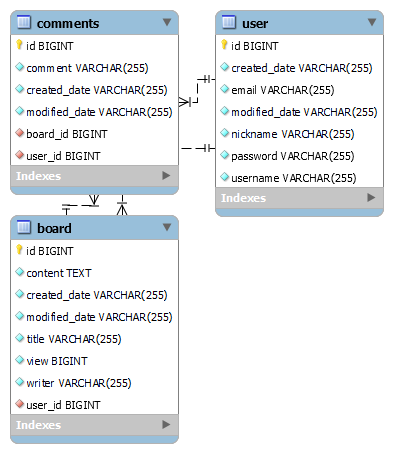

# Board Service
Board Service는 Spring Boot와 Thymeleaf, Spring Data JPA를 사용하여 구현한 간단한 게시판 애플리케이션입니다.
MySQL을 데이터베이스로 사용하며, 사용자 인증, 게시글 작성, 댓글 기능 등 여러 기능을 포함하고 있습니다.

----------------------------------
## 기술 스택
- Backend : springBoot, Spring MVC, Spring Data JPA, Spring Security
- Frontend : Thymeleaf, HTML, CSS, JavaScript
- Database : MySQL
- 빌드 도구 : grade
----------------------------------
## 주요 기능
1. 사용자 회원가입 및 로그인/로그아웃
 - 회원가입
   - 사용자는 회원가입 페이지에서 아이디, 비밀번호, 닉네임, 이메일 정보를 입력한다.
   - 비밀번호와 확인 비밀번호가 일치하는지 클라이언트와 서버 측에서 검증한다
   - 닉네임 중복 확이니 기능을 통해 닉네임 사용 가능 여부를 실시간으로 체크한다
 - 로그인
   - 사용자는 로그인 페이지에서 아이디와 비밀번호를 입력하여 로그인한다
   - 서버는 입력된 아이디로 사용자를 검색하고, 비밀번호 암호화 비교를 통해 인증한다.
   - 아이디가 존재하지 않거나 비밀번호가 일치하지 않을 경우, 각각 "없는 아이디 입니다." 또는 "아이디와 비밀번호가 일치하지 않습니다."라는 오류 메세지를 표시한다.
   - 로그인 성공 시, 사용자 정보를 HttpSession에 저장하고 메인 게시판 페이지로 리다이렉트된다.
 - 로그아웃
   - 로그아웃 버튼을 클릭하면 세션이 무효화되고 메인 게시판 페이지로 리다이렉트된다.
 - 조건부 버튼 표시
   - 메인 페이지(boardlist.html)에서는 세션에 로그인한 사용자가 있는 경우 로그인/회원가입 버튼을 숨기고, 대신 로그아웃 버튼과 "<사용자이름>님 환영합니다!" 메세지를 표시한다.
2. 게시판 기능(미구현)
- 게시판 목록 조회
  - 메인 페이지에서 게시글의 번호, 제목, 작성자, 작성일, 조회수를 표시한다.
  - 각 게시글에 대해 보기 링크를 통해 게시글 상세 페이지로 이동한다.
3. 댓글 기능(미구현)
- 게시글에 달린 댓글을 조회, 작성할 수 있도록 Comments 엔티티를 통해 DB에 저장된다.
- 댓글 작성시, 해당 게시글 번호와 사용자 정보를 외래키로 관리한다.
---------------------------------
## API EndPoints
### Auth 관련
- GET /auth/signup
    - 회원가입페이지(signup.html)을 반환
- GET /auth/login
  - 로그인 페이지(login.html)을 반환
    - URL에 error 쿼리 파라미터가 있을 경우, 해당 오류 메세지를 페이지에 표시
- POST /auth/register
  - 회원가입 처리를 수행
    - 요청 파라미터
      - username : 아이디
      - password : 비밀번호
      - confirmPassword : 비밀번호 확인
      - nickname : 닉네임
      - email : 이메일
    - 동작
      - 비밀번호와 확인 비밀번호가 일치하지 않으면, 오류메세지를 담아 회원가입 페이지로 리다이렉트
      - 회원가입 성공 시, /board/로 리다이렉트
- POST /auth/signin
  - 사용자 로그인 처리를 수행
    - 요청 파라미터
      - username : 이름
      - password : 비밀번ㅇ호
    - 동작
      - 먼저 입력한 아이디로 DB에서 사용자를 검색
      - 사용자가 없으면  "없는 아이디입니다." 오류 메세지를,
      - 사용자가 존재해도 비밀번호가 일치하지 않으면 "아이디와 비밀번호가 일치하지 않습니다." 오류 메세지를 포함해 로그인 페이지로 리다이렉트
      - 인증에 성공하면, 해당 사용자 정보를 세션에 저장하고 /board/로 리다이렉트
- GET /auth/logout
  - 사용자 로그아웃 기능
    - 세션을 무효화하고 메인 게시판 페이지(/board/)로 리다이렉트
- GET /auth/checkNickname
  - 회원가입 폼에서 AJAX를 통해 닉네임 중복 여부를 확인
    - 요청 파라미터
      - nickname : 확인할 닉네임
    - 응답
      - JSON 형식으로 { "available": true } 또는 { "available": false }를 반환
---------------------------------
### Board 관련
- GET /board/
  - 게시판 메인 페이지(boardlist.html)를 반환
    - 로그인한 사용자가 있을 경우(세션에 loggedInUser가 존재), 페이지 상단에 "<사용자>님 환영합니다!" 메세지를 표시
    - 로그인 상태에 따라 로그인/회원가입 버튼과 로그아웃 버튼이 조건부로 표시
- GET /board/write
  - 게시글 작성 페이지(boardwrite.html)를 반환
---------------------------------
### 데이터베이스 ERD
